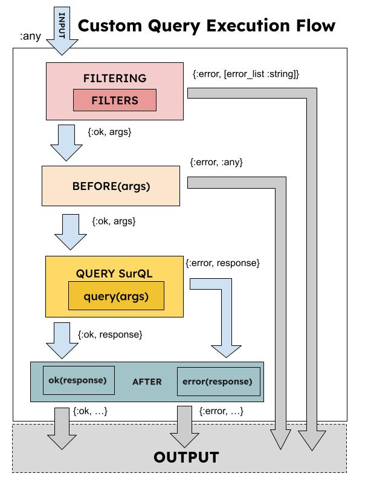

# Custom Queries



- **Filtering (Optional)**: `@callback filters(arg :: any) :: [(any() -> {:ok, nil} | {:error, bitstring()})]`
  
  During filtering we apply over input a list of functions `(any() -> {:ok, nil} | {:error, bitstring()})` that will take the input arguments and will return :ok, or :error with error message. 

  *Only in case all the the filters will fails (i.e. all will answers with {:ok, ...}) then will start before stage.*
- **Before (Optional)**: `@callback before(arg :: any) :: {:ok, any()} | {:error, any()}` 

  On before, we can prepare the arguments that will needed the query, and also we can avoid the execution returning `{:error, ...}`.
  
  *Only in case that before stage returns `{:ok, args}`, the flows will execute the query.*
- **Query:** ` @callback query(arg :: any) :: String.t()`
 
  On query method we can focus on write our Surreal DB SQL.


- **After (Optional)**:   
  - `@callback ok(response :: any) :: any()`
  In case the execution will be succesfull for all the responses (internally we used `SurrealEx.Response.all_status_ok?/1`) the flow will execute the `ok(response)`.
   
  - `@callback error(response :: any) :: any()`
   In case the execution will be unsuccess for all the responses (internally we used `SurrealEx.Response.all_status_ok?/1`) the flow will execute `error(response)`.

## Example 
```elixir
  defmodule ExampleFlow do
    use SurrealEx.Query,
      conn: SurrealExTest.QueryFiltersTest.Conn

    # its optional
    def filters(_args) do
      [
        ArgsChecker.required(:price_max),
        ArgsChecker.should_be(:price_max, :float),
        ArgsChecker.greater_than(:price_max, 0.0)
      ]
    end

    # before.. as you see on test its optional

    # query callback is mandatory.
    def query(args) do
      "SELECT * FROM car WHERE price <= #{args.price_max}"
    end

    # its optional
    def ok(response) do
      {:ok, response.result}
    end

    # its optional
    def error(_response) do
      {:error, "not expected case"}
    end

  end
```

Filtering process return us, string errors.

```elixir
  test "We expected that on before function checks args." do
    args = %{}
    {:error, detail} = ExampleFlow.run(args)

    assert detail == [
      "'price_max' is required",
      "'price_max' should be float",
      "'price_max' should be greater than 0.0"
    ]

    args = %{
      price_max: "15000.00"
    }
    {:error, detail} = ExampleFlow.run(args)

    assert detail == [
      "'price_max' should be float",
      "'price_max' should be greater than 0.0"
    ]
  end
```

We can see success execution test.

```
  test "Simple query testing" do
    args = %{
      price_max: 15000.00
    }
    {:ok, list_cars} = ExampleFlow.run(args)

    assert Enum.map(list_cars, fn car -> car["price"] <= 15000 end)
      |> Enum.all?
  end
```